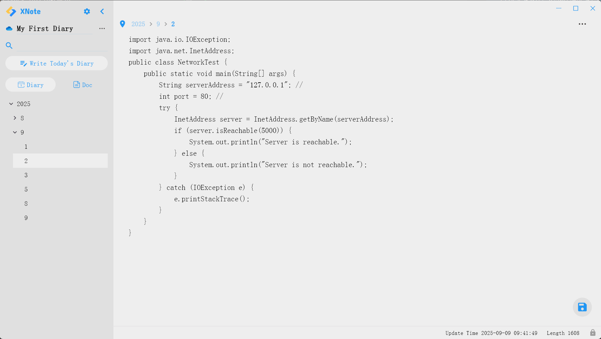

# x_note 日记软件

## 简介 | Introduction

x_note 是一款功能强大的开源日记与文档记录软件，旨在帮助用户轻松管理个人信息。无论是按日期记录日记，还是创建自定义文档，x_note 都能以树型目录的方式高效组织内容。

x_note is a powerful open-source diary and document recording application designed to help users manage personal information effortlessly. Whether recording diaries by date or creating custom documents, x_note organizes content efficiently using a tree-structured directory.

## 主要功能 | Key Features

- **按日期记录日记**：快速记录和查找历史内容，方便回顾。
- **支持自定义文档**：创建个性化文档，树型目录结构便于分类管理。
- **实时同步到个人 OneDrive**：确保数据安全，随时随地访问。
- **完全开源，保护隐私**：所有数据仅存储于用户自己的 OneDrive，绝不侵犯个人隐私。

- **Record diaries by date**: Quickly log and review historical content for easy retrospection.
- **Custom document creation**: Create personalized documents, organized with tree-structured directories.
- **Real-time sync to personal OneDrive**: Ensure data security and access anytime, anywhere.
- **100% open-source and privacy-friendly**: All data is stored only in the user's own OneDrive, with no privacy infringement.

## 截图 | Screenshots

## 开源协议 | License

本项目采用 Apache 2.0 协议，欢迎自由使用和贡献。

This project is licensed under the Apache 2.0 License. Contributions are welcome!

